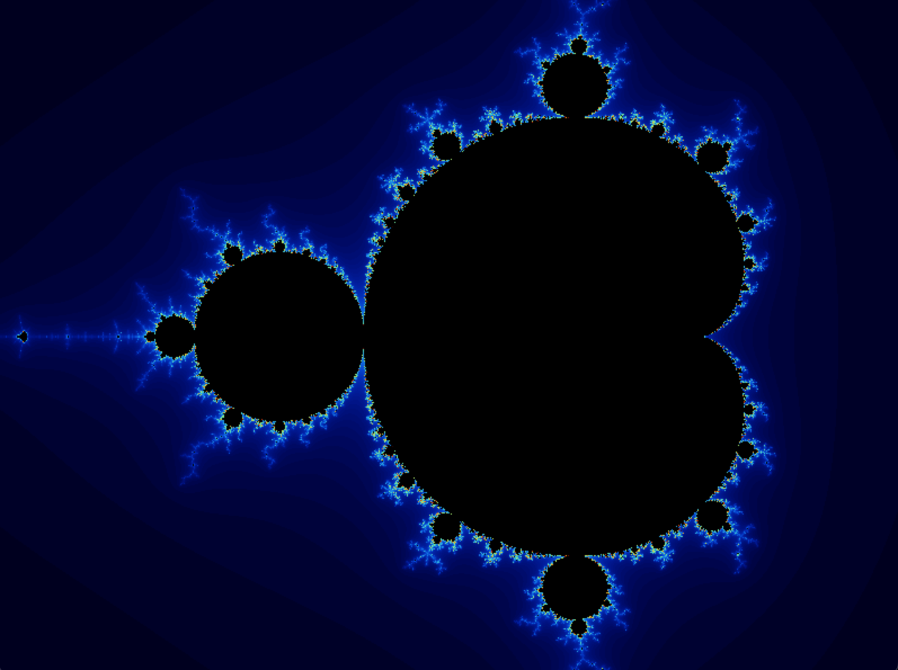
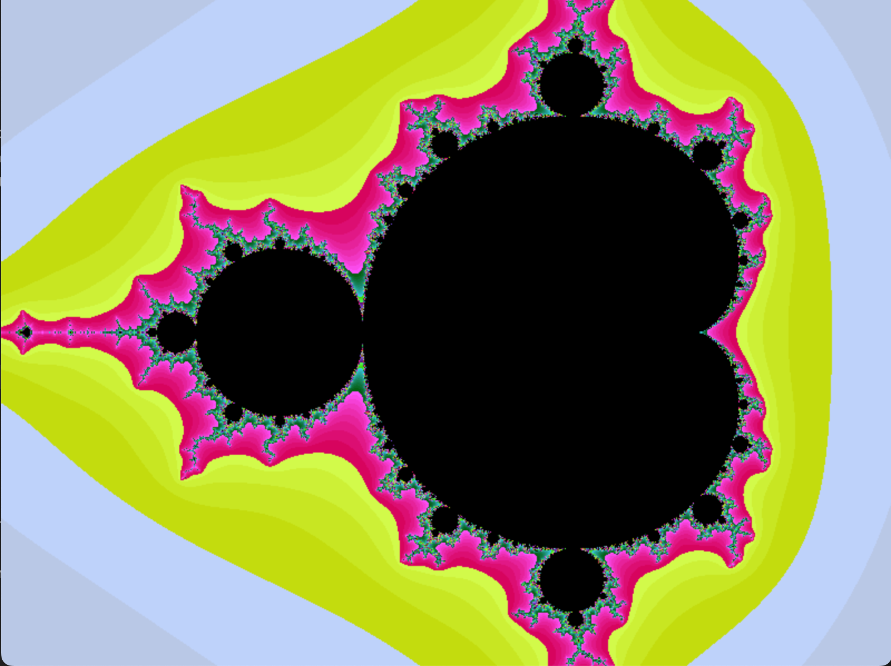

# 
**`fract'ol`**

## Introduction
### `Fract'ol` is one of the first graphical projects at 42 School in the "core cirriculum", it is meant to create graphically fractals. The project uses the school's graphical library: `MiniLibX`. 
#### What is fractal?
The term `fractal` was first used by mathematician Benoit Mandelbrot in 1974. He based it on the Latin word `fractus` which means "broken" or "fractured". A `fractal` is and abstract mathematical object, like a curve or a surface, which pattern remains the same at every scale.

## Mandelbrot set

